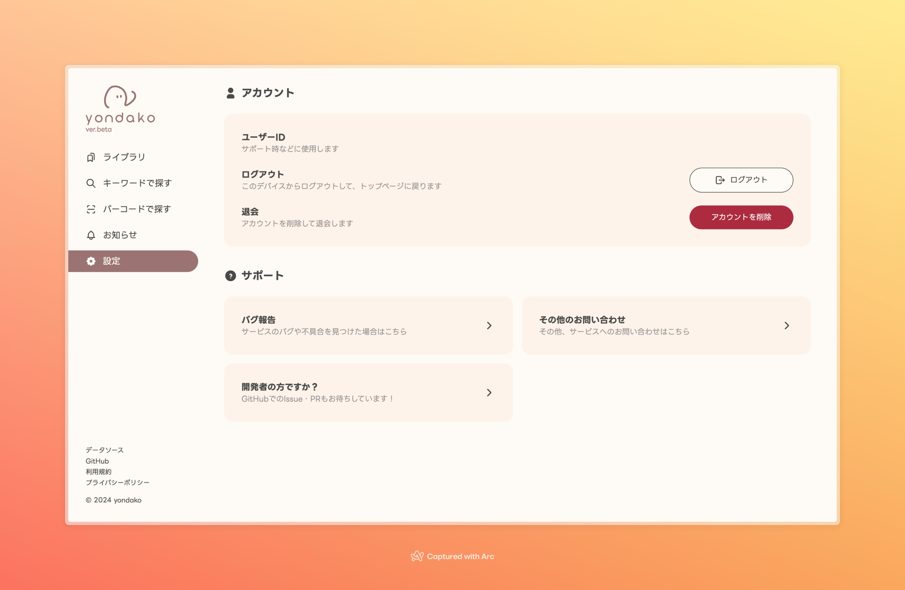

## 📚️ 検索を強化し、新刊に対応しました

今までは発売から数週間経たないと検索にヒットしなかったのですが、今回のアップデートで新刊の登録に対応しました。

私自身、使っていて不便だな～と思っていたのでとても嬉しいです 📚

## 🔧 設定ページにサポートに関する項目を追加しました

バグ報告や、その他お問い合わせフォームへのリンクを追加しました。

GitHub が唯一のバグ報告窓口でしたが、これでより気軽にお問い合わせいただけるようになるかと思います。

もし、なにかありましたらお気軽にお問い合わせください 🐾

---

新刊につよくなった yondako をよろしくお願いします 🐙
