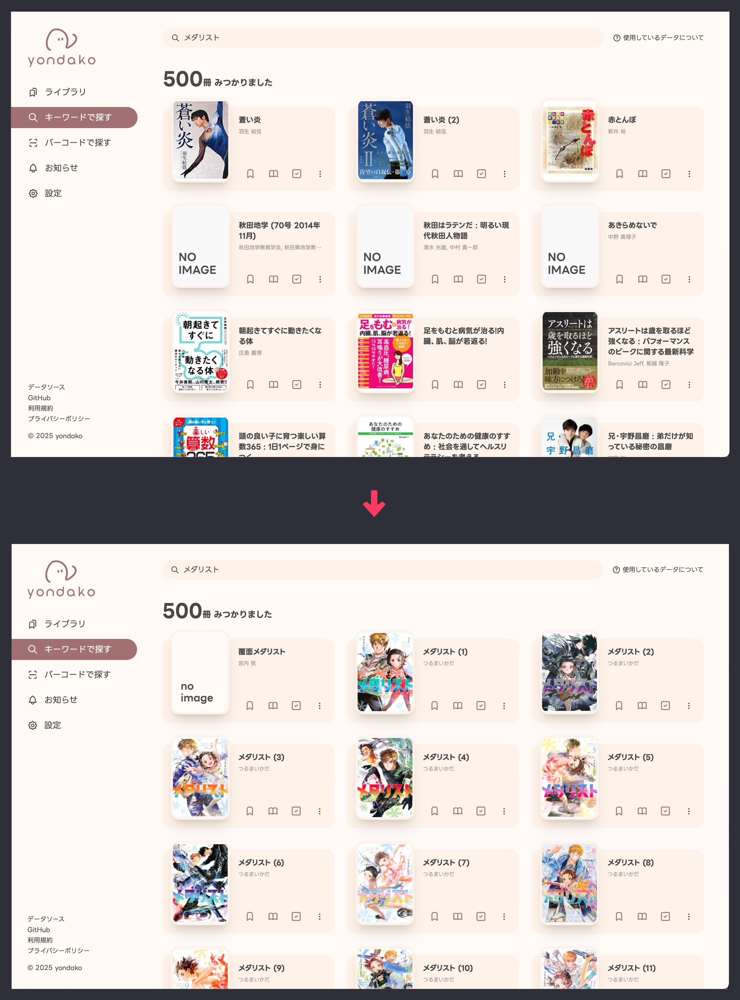
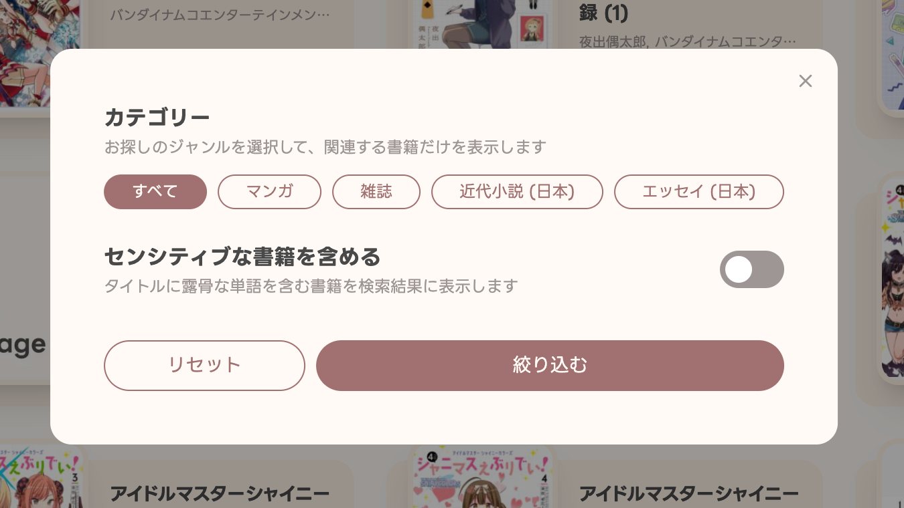

## 🙌 検索結果が一致順になりました

目的の本になかなか辿りつけないことがありましたが、これでかなり改善されるかと思います…！

（今まではなぜか50音順になっていました 🥺）

## 😎 検索結果の絞り込みを実装しました

「それでも目的の本に辿りつけない……」  
そんな時のために、ジャンル指定をさらに絞り込めるようになりました。

また、デフォルトでセンシティブな書籍が表示されなくなります。  
たま～にすごいタイトルの書籍が検索結果に表示されてびっくりすることがありましたが、これで安心です 🐱

---

ようやくまともに検索できるようになった yondako をよろしくお願いします 🐙
