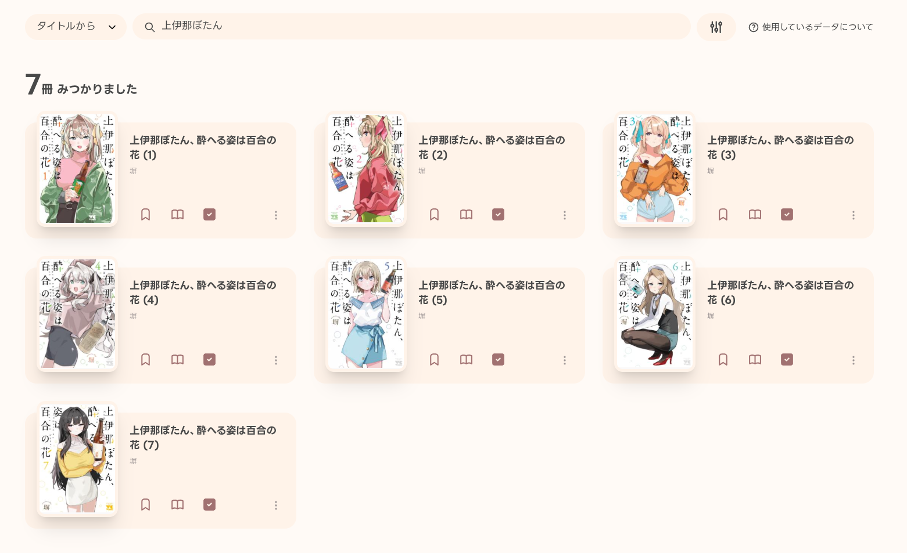
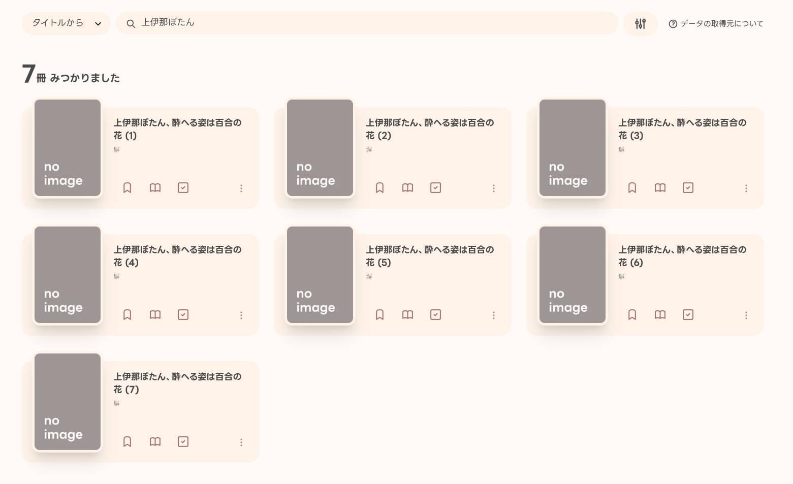
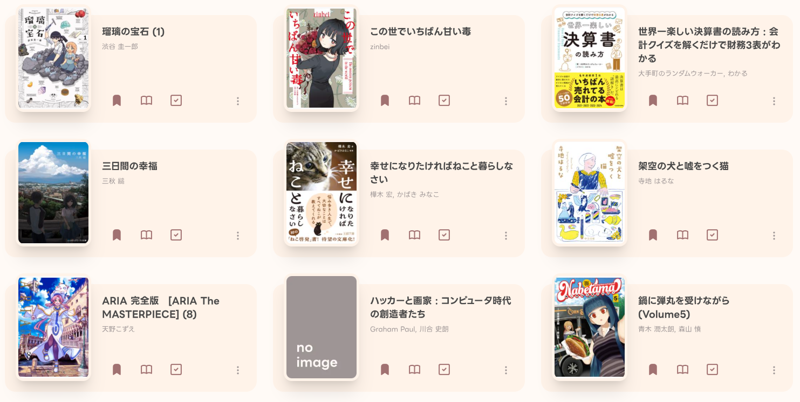
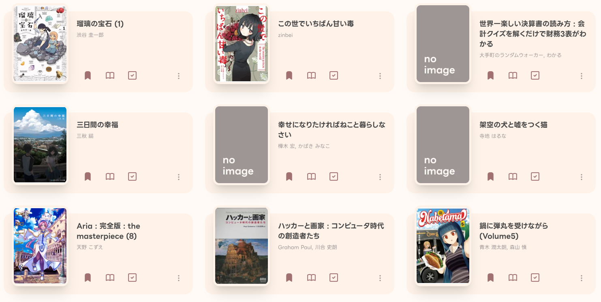

## 書影表示の仕様変更について

yondako で書影（本の表紙画像）を取得するために使っていたサービスが、2026年3月31日をもって提供終了となることが発表されました。

<blockquote class="twitter-tweet">
国立国会図書館サーチの書影APIをご利用の方へ 国立国会図書館サーチの外部提供インターフェース（API）のうち、書影画像を提供する書影APIは、2026年3月31日（火）をもってサービスを終了します。 詳細については、以下のページをご覧ください。<a href="https://t.co/yt9xUcJH7g">https://t.co/yt9xUcJH7g</a><a href="https://twitter.com/hashtag/NDL%E3%82%B5%E3%83%BC%E3%83%81?src=hash&amp;ref_src=twsrc%5Etfw">#NDLサーチ</a>
&mdash; 国立国会図書館　NDL (@NDLJP) <a href="https://twitter.com/NDLJP/status/2003635056112476613?ref_src=twsrc%5Etfw">December 24, 2025</a></blockquote> 

そのため、[楽天ブックス書籍検索API](https://webservice.rakuten.co.jp/documentation/books-book-search) を利用して書影を取得するように変更しました。

### これによって変わること

- ライブラリに登録している書籍については、**引き続き書影が表示されます**
    - 以前よりも書影が表示されない書籍が増えるかもしれません
    - ライブラリに登録した直後は書影が表示されない場合があります
- 検索結果では **書影が表示されなくなります**

---

具体的には、こんな感じになります。

### 検索結果

「上伊那ぼたん」で検索した場合の表示例です。

**変更前**

**変更後**

変更前はすべての書籍に書影が表示されていましたが、変更後は書影が表示されなくなります。

### ライブラリ

**変更前**

**変更後**

変更前はライブラリ内の多くの書籍に書影が表示されていましたが、変更後はいくつかの書籍で書影が表示されなくなっています。

---

少し寂しい変更となってしまいましたが、ご理解のほどよろしくお願いします。

そんな yondako をこれからもよろしくお願いします 🐙
